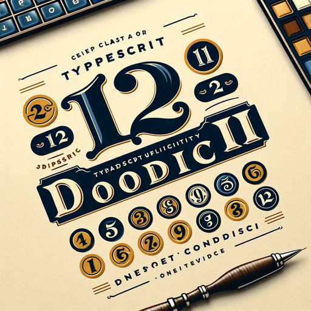

<h1 align="center">
   
  
   
  Dodici XII
   
</h1>

<h4 align="center">A comprehensive TypeScript utility library providing a wide range of commonly used types and utilities to enhance development efficiency and code quality for
<a href="https://www.typescriptlang.org/" target="_blank">Typescript projects</a>.</h4>

  
  
  
   

  <a href="#key-features">Key Features</a> •
  <a href="#how-to-use">How To Use</a> •
  <a href="#credits">Credits</a> •
  <a href="#license">License</a>

## Key Features

- **Rich Type Collection**: Access an extensive library of predefined TypeScript types for various use cases.
- **Enhanced Productivity**: Simplify complex type definitions and improve your code's readability and maintainability.
- **Community Contributions**: Benefit from a community-driven approach where contributions enrich the library's diversity and utility.
- **Easy to Use**: Seamlessly integrate with your projects to leverage the power of advanced TypeScript types.

## Credits

This software uses the following open source packages:

- [Node.js](https://nodejs.org/)
- [Typescript](http://www.typescriptlang.org/)
- [React](https://react.dev/)
- [React Native](https://reactnative.dev/)

## Support

## License

MIT

---

> [sarpkayature](https://www.sarpkayature.io) &nbsp;&middot;&nbsp;
> GitHub [@sarpkayature](https://github.com/sarpkayature) &nbsp;&middot;&nbsp;
> Twitter [@sarpkayature](https://twitter.com/sarpkayature)
